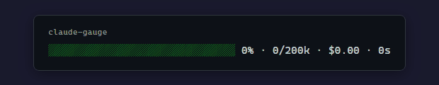
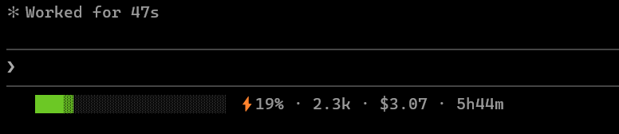
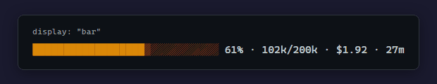
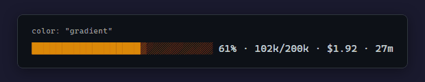

<p align="center">
  
</p>

<h1 align="center">claude-gauge</h1>

<p align="center">
  Rate limit awareness for Claude Code — without wasting a single token.
</p>

<p align="center">
  
  
  
  
</p>

---

You don't know you're approaching your rate limit until Claude stops responding. Checking with `/usage` breaks your flow. Alt-tabbing to the Anthropic dashboard breaks it even more.

**claude-gauge** puts a live session dashboard in your status line — rate limit utilization, token count, cost, and session duration, all in one glanceable bar. A lightweight local proxy captures rate limit headers from the Anthropic API. The bar fills as you consume quota — green when you're fine, red when you're running low. Always visible, zero interruption.

## How It Works

```
Claude Code  →  proxy (localhost:3456)  →  api.anthropic.com
                      ↓
               Captures rate limit headers
                      ↓
               Writes ~/.claude/gauge-rate-limits.json
                      ↓
               Gauge reads cache → displays fuel bar
```

A zero-dependency reverse proxy (`proxy.js`) sits between Claude Code and the Anthropic API. It forwards all requests, streams SSE responses without buffering, and captures `anthropic-ratelimit-unified-5h-utilization` from each response. The gauge reads this cache file and renders your quota as a fuel bar.

## Install

In Claude Code, run:

```
/plugin marketplace add mil-orb/claude-gauge

/plugin install claude-gauge
```

Restart Claude Code. The gauge appears in your status line immediately.

The install hook automatically starts the proxy and adds a **conditional** `ANTHROPIC_BASE_URL` to your shell profile — the env var is only set when the proxy is reachable, so if the proxy is down, Claude Code talks directly to the API instead of failing.

On Windows, you may also need to set it system-wide:

```powershell
[System.Environment]::SetEnvironmentVariable('ANTHROPIC_BASE_URL', 'http://localhost:3456', 'User')
```

## What You See

<p align="center">
  
</p>

```
████████▒░░░░░░░░░░░ ⚡32% · 47.9k · $1.84 · 3m
│                     │       │        │       └─ session duration
│                     │       │        └──────── session cost (USD)
│                     │       └───────────────── session tokens (input + output)
│                     └───────────────────────── 5h rate limit utilization
└─────────────────────────────────────────────── gauge bar (fills as quota is consumed)
```

- Bar **fills** from left as utilization climbs (use `drain` mode for a fuel gauge that empties)
- Color shifts green → yellow → red with your chosen color scheme
- `⚡32%` — your 5-hour rolling utilization percentage
- Session tokens are read from Claude Code's local JSONL transcript files

**Without proxy** — session metrics are still shown (tokens, cost, duration) without the rate limit bar.

## Display Types

Five built-in visualizations, all driven by rate limit when the proxy is running:

<p align="center">
  
</p>

| Type | Preview | Description |
|------|---------|-------------|
| `bar` | `██████████████░░░░░░` | Default — fills as quota is consumed |
| `drain` | `░░░░░░██████████████` | Fuel gauge — empties as quota is consumed |
| `dots` | `●●●●●●●●●●●●●○○○○○○` | Minimal circle pips |
| `blocks` | `⣿⣿⣿⣿⣿⣿⣿⣿⣿⣿⣿⣿⣿⠀⠀⠀⠀⠀⠀` | Dense braille blocks |
| `compact` | `● ⚡23%` | Text only, no bar |

## Color Schemes

Seven 24-bit true color schemes that escalate as utilization climbs:

<p align="center">
  
</p>

| Scheme | Transition | Style |
|--------|-----------|-------|
| `gradient` | green → yellow → red | Uniform fill, single color |
| `ocean` | cyan → blue → purple | Uniform fill |
| `ember` | yellow → orange → deep red | Uniform fill |
| `frost` | white → light blue → deep blue | Uniform fill |
| `retro` | green / yellow / red | Hard CGA steps at 33%/66% |
| `spectrum` | green → yellow → red | **Per-character gradient** — each bar character is a different color |
| `mono` | white → gray → dark | Grayscale |

`spectrum` is the only per-character scheme — it paints a full rainbow gradient across the bar width regardless of fill level. All others apply one color uniformly based on utilization percentage.

## Configuration

Run `/claude-gauge:config` for an interactive setup, or edit `config.json` in the plugin directory directly. Changes take effect on the next status line refresh — no restart needed.

```jsonc
{
  "display": "bar",           // bar, drain, dots, blocks, compact
  "color": "gradient",        // gradient, ocean, ember, frost, retro, spectrum, mono
  "bar_size": "medium",       // small (10), medium (20), large (30), xlarge (40), or a number
  "show_cost": true,          // running session cost in USD
  "show_duration": true,      // elapsed session time
  "show_lines": false,        // lines added and removed
  "currency_rate": null,      // local currency conversion (e.g. 0.79 for GBP, symbol auto-detected)
  "show_rate_limit": true     // enable rate limit gauge (requires proxy)
}
```

> **Tip:** Config path is `~/.claude/plugins/claude-gauge/config.json`

## Proxy Management

```bash
node scripts/proxy-ctl.js start    # start proxy (detached)
node scripts/proxy-ctl.js stop     # stop proxy
node scripts/proxy-ctl.js status   # check if running
```

The proxy listens on port 3456 by default. Set `GAUGE_PROXY_PORT` to change it.

Cache staleness: if the proxy hasn't updated the cache in 10 minutes, the gauge falls back to the "no proxy" display. This prevents showing stale rate limit data.

Set `"show_rate_limit": false` in config.json to disable rate limit tracking entirely.

## Troubleshooting

**`ECONNREFUSED` errors / Claude Code can't reach the API**

If the proxy is down and `ANTHROPIC_BASE_URL` still points to it, API calls will fail. To fix immediately:

```bash
# Option 1: Run the uninstall cleanup script
bash ~/.claude/plugins/cache/mil-orb/claude-gauge/*/scripts/uninstall.sh

# Option 2: Unset the env var for the current session
unset ANTHROPIC_BASE_URL
```

Then restart Claude Code. Re-running setup will install the newer conditional export that avoids this issue:

```bash
bash ~/.claude/plugins/cache/mil-orb/claude-gauge/*/scripts/setup.sh
```

**Proxy not starting**

```bash
# Check status
node ~/.claude/plugins/cache/mil-orb/claude-gauge/*/scripts/proxy-ctl.js status

# Restart it
node ~/.claude/plugins/cache/mil-orb/claude-gauge/*/scripts/proxy-ctl.js start
```

**Stale rate limit data**

If the gauge shows old data, the proxy may have stopped updating. Restart it with the command above. The gauge automatically hides rate limit data when the cache is older than 10 minutes.

## Uninstall

In Claude Code, run:

```
/plugin uninstall claude-gauge
```

Then run the cleanup script to remove shell profile entries and stop the proxy:

```bash
bash ~/.claude/plugins/cache/mil-orb/claude-gauge/*/scripts/uninstall.sh
```

On Windows, also remove the system variable:

```powershell
[System.Environment]::SetEnvironmentVariable('ANTHROPIC_BASE_URL', $null, 'User')
```

## Requirements

- Node.js 18+ (included with Claude Code)
- A terminal with 24-bit color support (most modern terminals)
- No additional dependencies (proxy uses Node.js built-in `http`/`https`)

## License

MIT
