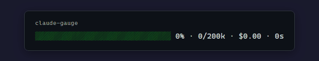
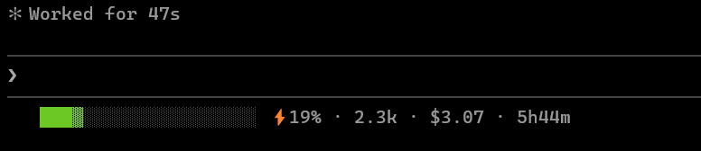
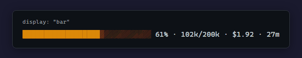
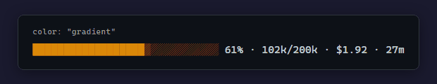

<p align="center">
  
</p>

<h1 align="center">claude-gauge</h1>

<p align="center">
  Rate limit awareness for Claude Code — without wasting a single token.
</p>

<p align="center">
  
  
  
  
  <a href="https://github.com/mil-orb/claude-gauge/actions/workflows/github-code-scanning/codeql"></a>
</p>

---

You don't know you're approaching your rate limit until Claude stops responding. Checking with `/usage` breaks your flow. Alt-tabbing to the Anthropic dashboard breaks it even more.

**claude-gauge** puts a live session dashboard in your status line — rate limit utilization, token count, cost, and session duration, all in one glanceable bar. A lightweight local proxy captures rate limit headers from the Anthropic API. The bar fills as you consume quota — green when you're fine, red when you're running low. Always visible, zero interruption.

## How It Works

```
Claude Code  →  proxy (localhost:3456)  →  api.anthropic.com
                      ↓
               Captures rate limit headers
                      ↓
               Writes ~/.claude/gauge-rate-limits.json
                      ↓
               Gauge reads cache → displays fuel bar
```

A zero-dependency reverse proxy (`proxy.js`) sits between Claude Code and the Anthropic API. It forwards all requests, streams SSE responses without buffering, and captures `anthropic-ratelimit-unified-5h-utilization` from each response. The gauge reads this cache file and renders your quota as a fuel bar.

## Install

**Step 1** — In Claude Code, run these two commands:

```
/plugin marketplace add mil-orb/claude-gauge
/plugin install claude-gauge
```

**Step 2** — Restart Claude Code.

That's it. The gauge appears in your status line immediately.

> **What happens behind the scenes:** The install hook starts a lightweight local proxy and sets `ANTHROPIC_BASE_URL` for each session via Claude Code's `CLAUDE_ENV_FILE` mechanism — scoped to just that session, no global environment changes. If the proxy isn't running when a session starts, the env var is simply not set and Claude Code talks directly to the API as normal.

## What You See

<p align="center">
  
</p>

```
████████▒░░░░░░░░░░░ ⚡32% · 47.9k · $1.84 · 3m
│                     │       │        │       └─ session duration
│                     │       │        └──────── session cost (USD)
│                     │       └───────────────── session tokens (input + output)
│                     └───────────────────────── 5h rate limit utilization
└─────────────────────────────────────────────── gauge bar (fills as quota is consumed)
```

- Bar **fills** from left as utilization climbs (use `drain` mode for a fuel gauge that empties)
- Color shifts green → yellow → red with your chosen color scheme
- `⚡32%` — your 5-hour rolling utilization percentage
- Session tokens are read from Claude Code's local JSONL transcript files

**Without proxy** — session metrics are still shown (tokens, cost, duration) without the rate limit bar.

## Display Types

Five built-in visualizations, all driven by rate limit when the proxy is running:

<p align="center">
  
</p>

| Type | Preview | Description |
|------|---------|-------------|
| `bar` | `██████████████░░░░░░` | Default — fills as quota is consumed |
| `drain` | `░░░░░░██████████████` | Fuel gauge — empties as quota is consumed |
| `dots` | `●●●●●●●●●●●●●○○○○○○` | Minimal circle pips |
| `blocks` | `⣿⣿⣿⣿⣿⣿⣿⣿⣿⣿⣿⣿⣿⠀⠀⠀⠀⠀⠀` | Dense braille blocks |
| `compact` | `● ⚡23%` | Text only, no bar |

## Color Schemes

Seven 24-bit true color schemes that escalate as utilization climbs:

<p align="center">
  
</p>

| Scheme | Transition | Style |
|--------|-----------|-------|
| `gradient` | green → yellow → red | Uniform fill, single color |
| `ocean` | cyan → blue → purple | Uniform fill |
| `ember` | yellow → orange → deep red | Uniform fill |
| `frost` | white → light blue → deep blue | Uniform fill |
| `retro` | green / yellow / red | Hard CGA steps at 33%/66% |
| `spectrum` | green → yellow → red | **Per-character gradient** — each bar character is a different color |
| `mono` | white → gray → dark | Grayscale |

`spectrum` is the only per-character scheme — it paints a full rainbow gradient across the bar width regardless of fill level. All others apply one color uniformly based on utilization percentage.

## Configuration

Run `/claude-gauge:config` for an interactive setup, or edit `config.json` in the plugin directory directly. Changes take effect on the next status line refresh — no restart needed.

```jsonc
{
  "display": "bar",           // bar, drain, dots, blocks, compact
  "color": "gradient",        // gradient, ocean, ember, frost, retro, spectrum, mono
  "bar_size": "medium",       // small (10), medium (20), large (30), xlarge (40), or a number
  "show_cost": true,          // running session cost in USD
  "show_duration": true,      // elapsed session time
  "show_lines": false,        // lines added and removed
  "currency_rate": null,      // local currency conversion (e.g. 0.79 for GBP, symbol auto-detected)
  "show_rate_limit": true     // enable rate limit gauge (requires proxy)
}
```

> **Tip:** Config path is `~/.claude/plugins/claude-gauge/config.json`

## Proxy Management

```bash
node scripts/proxy-ctl.js start    # start proxy (detached)
node scripts/proxy-ctl.js stop     # stop proxy
node scripts/proxy-ctl.js status   # check if running
```

The proxy listens on port 3456 by default. Set `GAUGE_PROXY_PORT` to change it.

Cache staleness: if the proxy hasn't updated the cache in 10 minutes, the gauge falls back to the "no proxy" display. This prevents showing stale rate limit data.

Set `"show_rate_limit": false` in config.json to disable rate limit tracking entirely.

## Troubleshooting

**`ECONNREFUSED` errors / Claude Code can't reach the API**

If the proxy dies mid-session, `ANTHROPIC_BASE_URL` still points to it for that session. The supervisor auto-restarts the proxy within ~500ms, but if it fails permanently:

```bash
# Immediate fix — unset for the current session
unset ANTHROPIC_BASE_URL
```

Starting a new session will re-evaluate proxy availability — if the proxy is down, the env var won't be set and Claude Code routes directly to the API.

**Proxy not starting**

```bash
# Check status
node ~/.claude/plugins/cache/mil-orb/claude-gauge/*/scripts/proxy-ctl.js status

# Restart it
node ~/.claude/plugins/cache/mil-orb/claude-gauge/*/scripts/proxy-ctl.js start
```

**Stale rate limit data**

If the gauge shows old data, the proxy may have stopped updating. Restart it with the command above. The gauge automatically hides rate limit data when the cache is older than 10 minutes.

## Uninstall

> **Important:** Do not use `/plugin uninstall claude-gauge` — it deletes plugin files before cleanup can run, leaving orphan proxy processes behind.

**Step 1** — Run the uninstall script:

```bash
bash ~/.claude/plugins/cache/mil-orb/claude-gauge/*/scripts/uninstall.sh
```

**Step 2** — Remove the plugin from Claude Code:

```
/plugin uninstall claude-gauge
```

**Step 3** — Start a new Claude Code session.

The current session's environment still has `ANTHROPIC_BASE_URL` pointing at the (now-stopped) proxy. A new session starts clean.

<details>
<summary>What the uninstall script does</summary>

- **Stops the proxy** — kills the supervisor and force-kills any orphan processes still holding the port
- **Removes artifacts** — `~/.claude/gauge-proxy.pid` and `~/.claude/gauge-rate-limits.json`
- **Restores your status line** — restores your previous statusline config from backup, or removes the `statusLine` block from `~/.claude/settings.json`

</details>

## Security

The proxy binds to `127.0.0.1` only — it is not exposed to the network. All upstream traffic is forwarded over TLS to `api.anthropic.com`.

The localhost hop between Claude Code and the proxy is plaintext HTTP. This means your API key is visible to any process running as your user on the loopback interface. In practice this is the same trust boundary as the default Claude Code setup, where the API key is stored in an environment variable readable by any local process.

The setup script sets `ANTHROPIC_BASE_URL` via Claude Code's `CLAUDE_ENV_FILE` — a session-scoped mechanism that writes no persistent state to shell profiles or system environment variables. The `GAUGE_PROXY_PORT` value is validated numeric before interpolation into any commands.

The proxy has zero npm dependencies. The entire codebase is auditable in a few files.

## Requirements

- Node.js 18+ (included with Claude Code)
- A terminal with 24-bit color support (most modern terminals)
- No additional dependencies (proxy uses Node.js built-in `http`/`https`)

## License

MIT
